# Actividade 3.2 - Recursos compartidos en Samba 4 AD con Ubuntu Server
Índice
- Deshackear /etc/hosts
- Infraestructura AD con samba tools
- Gestión de recursos compartidos

## Deshackear /etc/hosts
El abuso del archivo */etc/hosts* para resolver nombres de dominio va en contra de las buenas prácticas, ya que Samba AD utiliza su propio DNS configurado como parte de su infraestructura. La configuración del servicio DNS de Samba AD
 debería manejarse con el archivo */etc/resolv.conf*.Al depender demasiado de */etc/hosts*, estamos ignorando la configuración el servicio DNS del controlador de dominio.

Modificamos el archivo */etc/resolv.conf* para que en él se referencie al servidor y las peticiones DNS se dirijan a este directamente.
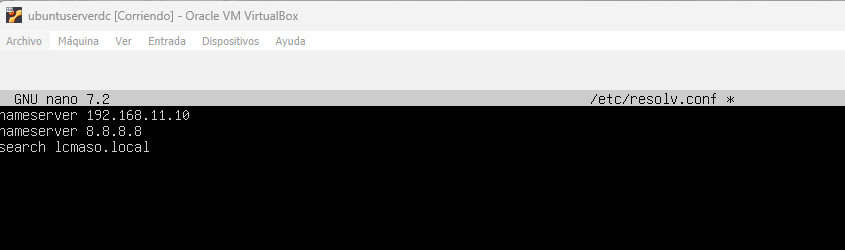  
Editamos el archivo */etc/hosts* 
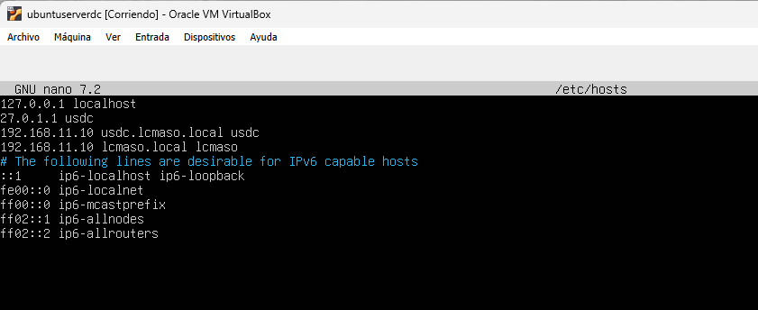  
Eliminamos las referencias al dominio en el archivo */etc/hosts* del servidor  
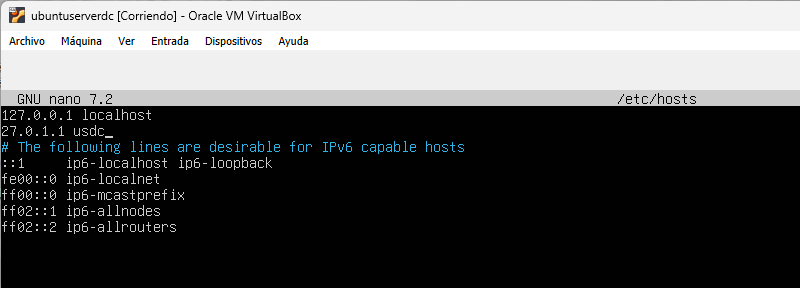  
 De esta forma optimizamos nuestro servicio manteniendo las buenas prácticas.
## Infraestructura AD con samba tools
Vamos a crear en nuestro servidor samba, a través de la herramienta *samba-tools*, una estructura de grupos y usuarios samba.  
La estructura será la siguiente  
|Grupo|Usuarios|
|-----|--------|
|g1|usu1, usu2|
|g2|usu1, usu3|
|g3|usu1, usu4|

### Crear grupos  
~~~
sudo samba-tool group create "grupo"
~~~
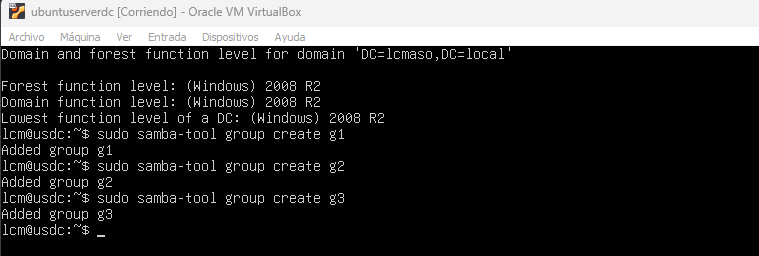  

### Crear usuarios  
~~~
sudo samba-tool user add "usuario"
~~~
  

### Agregar miembros a grupos  
~~~
sudo samba-tool group addmembers "grupo" "usuario"
~~~
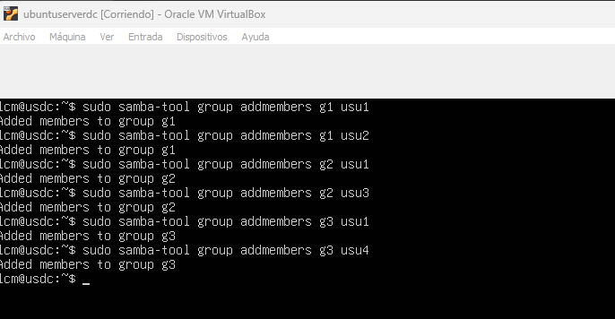  

### Configuraciones de autenticación
Modificamos el archivo /etc/samba/smb.conf y añadimos las lineas para el servicio winbind  
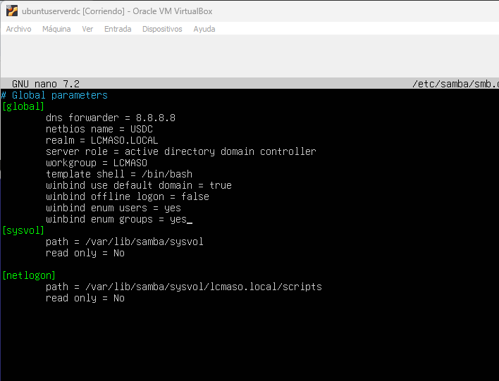  

Comprobamos que el archivo de configuración samba este correcto con *testparm*   
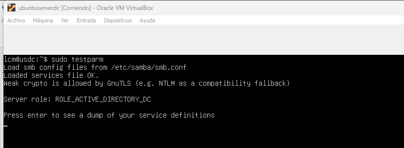  

Reiniciamos el servicio samba

~~~
sudo systemctl restart samba-ad-dc.service
~~~

Configuramos el modulo *auth-pam* para que las cuentas de AD se puedan autentificar en el servidor y se genere un directorio host con cada auth  
~~~
sudo pam-auth-update
~~~
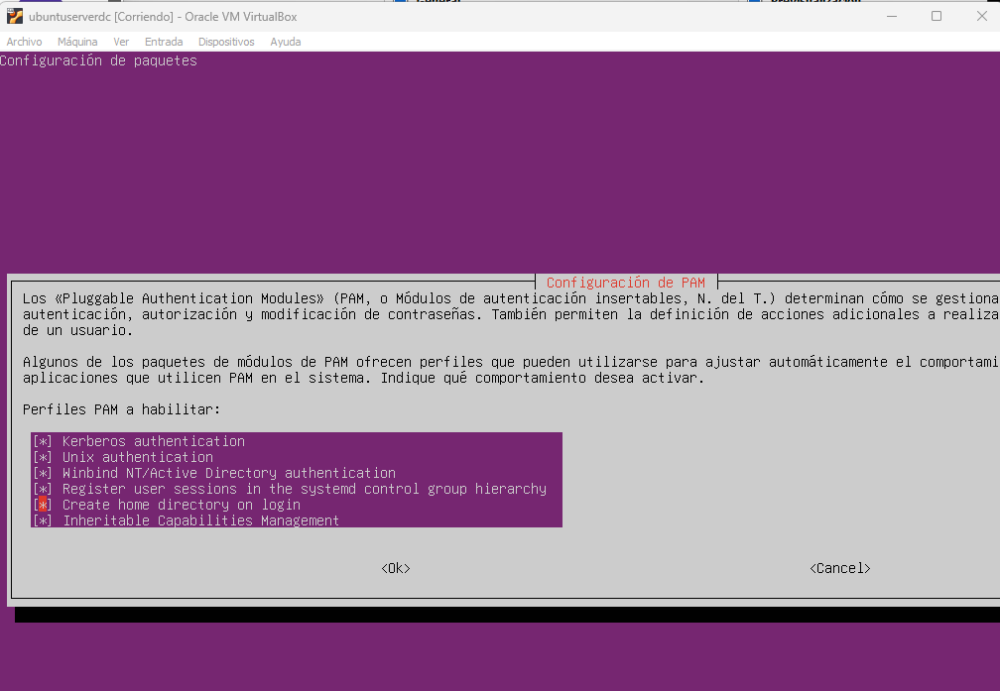  

Añadimos winbind al archivo /etc/nsswitch.conf para que lo utilice cuando queramos acceder con usuarios y grupos de AD
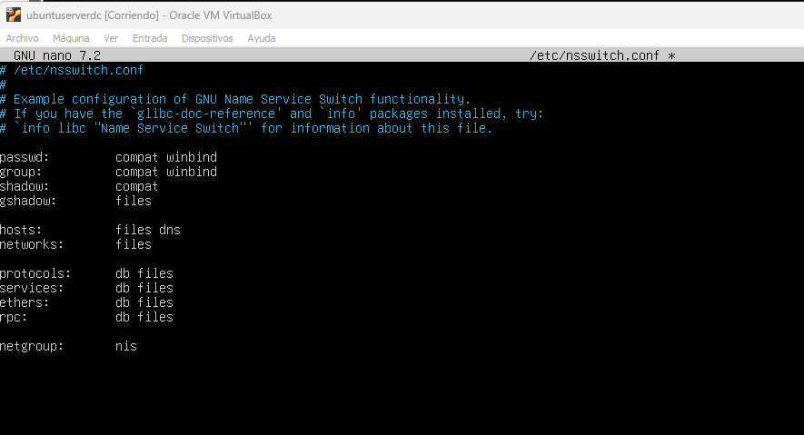  
Modificamos el fichero /etc/pam.d/common-password  
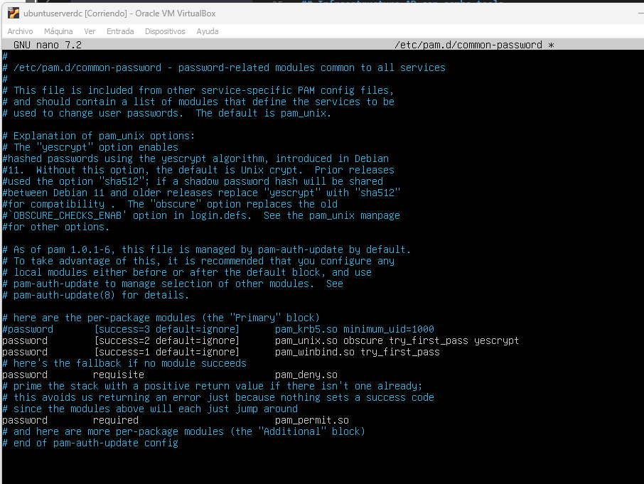  

Comprobamos como podemos acceder a la información de usuarios y grupos  
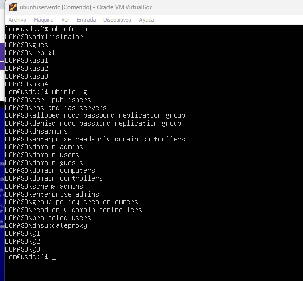  

## Recursos compartidos
Creamos los directorios para cada grupo  
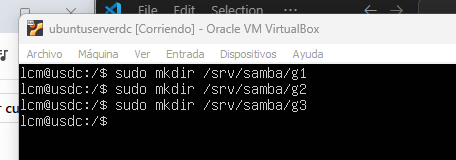  
Configuramos los permisos de usuarios sobre los directorios de grupo  
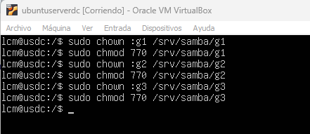  

Configuramos la compartición de carpetas de grupo en el archivo smb.conf
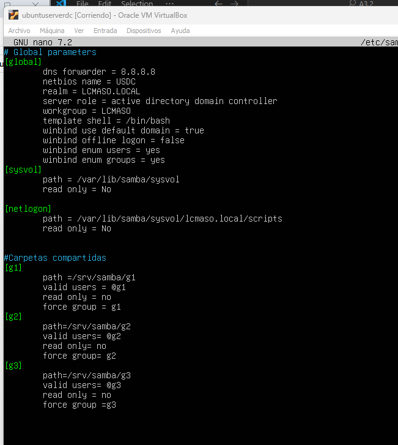  

Ahora para ajustarnos a las instrucciones de la práctica vamos a crear un directorio *NASlcm* en nuestro directorio raíz para mover ahí las carpetas compartidas  
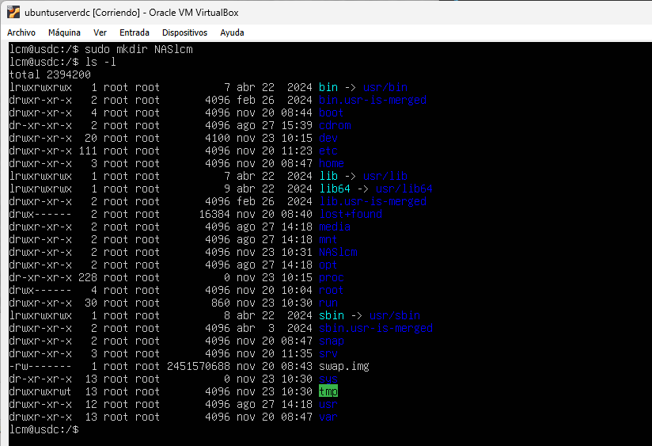  

Movemos las carpetas compartidas al directorio 
~~~
sudo mv srv/samba/ NASlcm/samba/
~~~
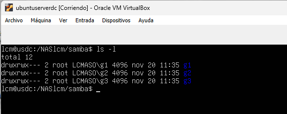  

y ajustamos el archivo smb.conf para corregir la ruta   
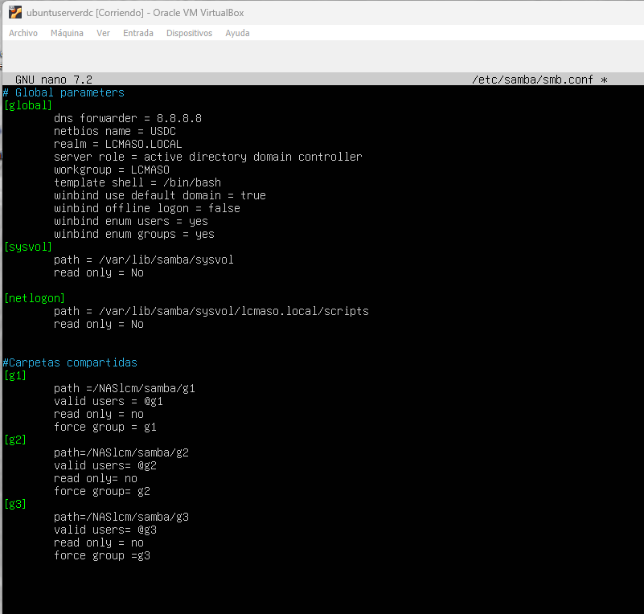  

Comprobamos como nuestros usuarios tienes acceso únicamente a las carpetas a las que les hemos concedido permiso  
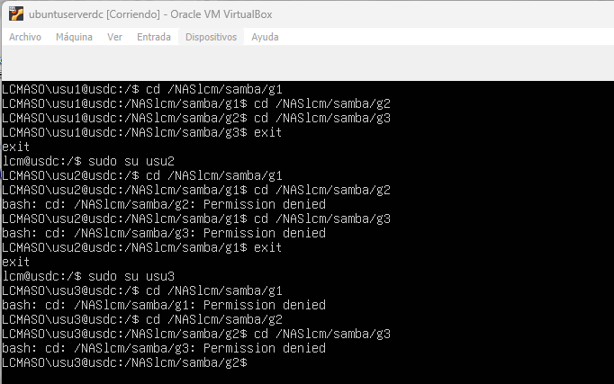  
Ahora vamos a modificar nuestro archivo smb.conf para dar permisos al administrador y para que los permisos se hereden a las carpetas hijas creadas en estas.  
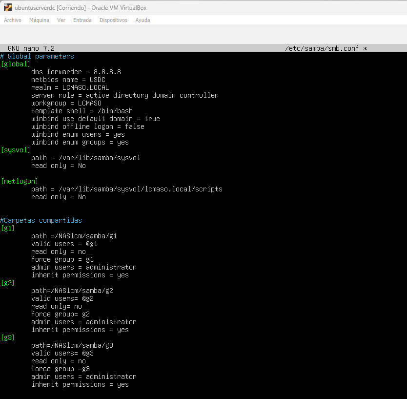  
Ahora damos permisos ACl al administrador sobre las carpetas  
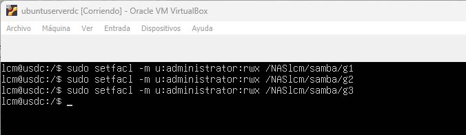  
El administrador ya tiene acceso a nuestras carpetas compartidas  
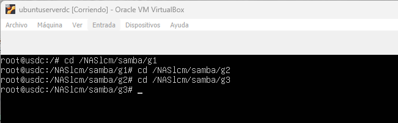

